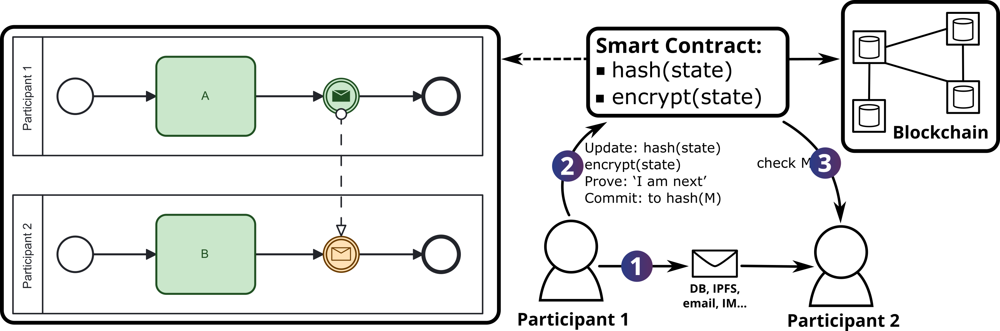

# zkWF2

This is the second iteration of the zkWF (Zero Knowledge Workflow) project. The goal of this project is to create a workflow engine like system that can orchestrate business processes in a confidential and secure manner on a public blockchain. 

## About zkWF

zkWF is a zero-knowledge workflow protocol that enables secure, verifiable process execution across untrusted parties. At its core, zkWF uses blockchain-based smart contracts to enforce correctness while preserving confidentiality. Each process instance is governed by a dedicated smart contract, which stores:   

1. A hash commitment to the current state of the workflow, and  
2. An encrypted version of the state itself.
     

During execution, participants exchange messages off-chain (e.g., via direct communication channels). These interactions are modeled in the workflow specification as intermediate message events, and their cryptographic hashes are incorporated into the commitment scheme.   

To progress the workflow (i.e., "step" the process), a participant must submit a Zero-Knowledge Proof (ZKP) to the smart contract, proving the proposed state transition is valid. If the step involves sending a message, the new state includes the hash of that message. When a party receives a message in a subsequent phase, it verifies the hash against the smart contract’s stored commitment. The message is only accepted if the hashes match, ensuring integrity without exposing sensitive data.   

Here's a high-level overview of this process:




## Project Structure

The project is divided into the following components:
- cmds: Contains the command line interface for the project
   - zkWF: The main command line interface for the project
- pkg: Contains the core logic of the project
   - common: Contains common utility functions
   - circuits: Contains the zkSNARK circuits for the project
      - expressions: This handles the boolean expressions in the workflows
      - gmimc: This is where the GMiMC encryption circuit is defined
      - hkdf: This is where the HKDF is implemented
      - lifecycle: The lifecycle state machine circuit
      - utils: Contains utility functions for the circuits
      - statechechker: The main zkSNARK circuit for the project
  - contracts: contains the smart contract interactions for the project
  - crypto: Contains the cryptographic functions for the project that are not part of the zkSNARK circuits, e.g. to generate inputs, keys
  - model: Handles the parsing of the BPMN models
  - powersoftau: Contains the powers of tau loading functions. This is used as the trusted setup for the zkSNARK circuits
  - web3: Contains the web3 interactions for the project
  - zkp: Contains the zero knowledge proof functions for the project
- solidity: Contains the solidity contracts for the project
- models: Contains the BPMN models and their corresponding JSON test cases
- editor: Contains the BPMN editor for the project that has the capabilities to use the extended attributes and payment tasks

## Installation

### Prerequisites

- Go
- Node.js
- Solc

### Steps

1. Clone the repository

```bash
git clone https://github.com/ftsrg/zkWF.git
```

2. Compile the zkWF command line interface

```bash
go build -o bin/zkWF ./cmds/zkWF
```

3. Install the npm packages

```bash
cd editor && npm install
```

4. Start the editor

```bash
npm start
```

## Usage

### zkWF Command Line Interface

The zkWF command line interface can be used to interact with the project. The following commands are available:

```
zkWF is a zero-knowledge workflow system

Usage:
  zkwf [command]

Available Commands:
  compile      Compile a BPMN file into a zero-knowledge circuit
  completion   Generate the autocompletion script for the specified shell
  deploy-ecdh  Deploy the ECDH contract with predefined public keys
  fill-inputs  Fill inputs for the zkWF circuit
  generate-key Generate a new eddsa key pair
  help         Help about any command
  prove        Prove a statement using a given circuit and witness
  setup        Setup a zero-knowledge circuit
  sign         Sign a given input
  witness      Generate a witness for a given input

Flags:
  -h, --help   help for zkwf
```

### Typical Workflow

0. Generate a new key pair

```bash
./bin/zkWF generate-key
```

This will generate a new key pair and save it to the `keys.json` file. You will need to put the public key into the model using the BPMN editor. The public key shall be provided as follows: `X,Y` where `X` is the x-coordinate of the point on the curve and `Y` is the y-coordinate of the point on the curve.

1. Compile the BPMN model into a zero-knowledge circuit

```bash
./bin/zkWF compile models/t1_zkp.bpmn
```

2. Setup the zero-knowledge circuit

```bash
./bin/zkWF setup circuit.r1cs
```

3. Fill the inputs for the zero-knowledge circuit

First, prepare the inputs manually in the `inputs.json` file. Then, fill the inputs for the zero-knowledge circuit

```bash
./bin/zkWF fill-inputs inputs.json keys.json
```

This will fill out the hash, randomnness, public key, and signature inputs for the circuit.

4. Generate a witness for the given input

```bash
./bin/zkWF witness models/t1_zkp.bpmn inputs.json keys.json
```

5. Prove the statement using the given circuit and witness

```bash
./bin/zkWF prove circuit.r1cs pk.bin full.wtns
```

## Citation
If you use zkWF in your research or project, please cite the following paper:

```
@article{zkWF1,
  title={Blockchain-Based, Confidentiality-Preserving Orchestration of Collaborative Workflows},
  volume={15},
  ISSN={20612079},
  DOI={10.36244/ICJ.2023.3.8},
  number={3},
  journal={Infocommunications Journal},
  author={Toldi, Balázs Ádám and Kocsis, Imre},
  year={2023},
  pages={72–81},
  language={en}
}
```

> [!NOTE]  
> This paper describes the initial iteration of the zkWF project. A follow-up paper covering the current version of the implementation is currently in progress.