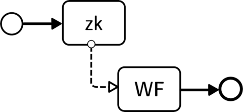

# zkWF (Zero-Knowledge WorkFlow engine)

A Blockchain-based, confidentiality-preserving orchestration engine of collaborative workflows.

## Showcase Video

Check out our showcase video [here](https://www.youtube.com/watch?v=ER7GOUJayPc) to see zkWF in action!

## Structure
The project is stuctured into multiple directories:

- generator - This folder contains the WFGUI applicatin and the zkWF program generator code.
- editor - Modeler for the zkWF programs. Includes the extended BPMN attributes.
- verifier - code for the state-manager smart contract
- verifier_fabric - verifier smart contract for Hyperledger Fabric

## Usage
### WFGUI
To compile and run the WFGUI component of zkWF, follow these steps:

1. Open a terminal or command prompt and navigate to the generator directory.
2. Run the following command to compile the WFGUI: `./gradlew gui:shadowjar` (on Linux) or `gradlew.bat gui:shadowjar` (on Windows).
3. Once the compilation process completes, navigate to the gui/build/libs directory.
4. Launch the WFGUI by running the following command: `java -jar WFGUI.jar`

### CLI
To compile the CLI tool, execute the following Gradle command: `./gradlew cli:shadowjar` (on Linux) or `gradlew.bat cli:shadowjar` (on Windows).

- The tool is compiled to a JAR called cli-1.0-SNAPSHOT-all.jar.
- To run test cases in a batch using the CLI component, use the following Java command: `java -jar cli-1.0-SNAPSHOT-all.jar [OPTIONS] <bpmnFile> <testCases>`.
- The available options are:
  - --deploy: Deploys the smart contract. Default is false.
  - --skip-setup: Skips the setup phase. Default is false.
  - --skip-tests: Skips all test cases and only does the setup and compilation phase. Default is false.
- To list the available parameters for the CLI component, use the --help option.

## Authors
- Balázs Ádám Toldi
- Dr. Imre Kocsis

## List of dependencies  

- ZoKrates pyCrypto

## License

zkWF is released under the Apache License 2.0.

## Acknowledgements
This work was partially created under, and financed through, the Cooperation Agreement between the Hungarian National Bank (MNB) and the Budapest University of Technology and Economics (BME) in the Digitisation, artificial intelligence and data age workgroup. The work of Imre Kocsis was partially funded by the National Research, Development, and Innovation Fund of Hungary under Grant TKP2021-EGA-02.
